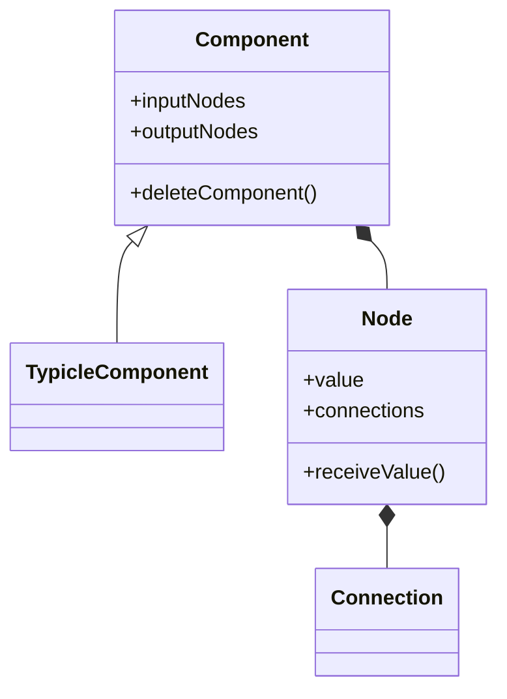

# 112tp
 Ziru's 15112 term project

A visual programming interface for parametric design built with Python, inspired by Grasshopper.

## Features

**Components**
- 🔷 Geometry: Circle, Rectangle, Point
- 🔢 Math: Add, Subtract, Multiply, Divide, Square, Square Root, Pi, Absolute
- ➡️ Vector: Point, Vector, Preview
- 🔄 Manipulation: Move

**Interaction**
- Drag & drop components
- Visual node connections
- Multi-select and group movement
- Double-click deletion

**Interface**
- Component categories
- Display toggles
- Grid and axis system
- Visual feedback

## Keyboard Shortcuts
| Key | Action |
|-----|---------|
| S | Create Slider |
| C | Create Circle |
| R | Create Rectangle |
| P | Create Point |
| Delete | Remove Selected |

## Technical Design
- One-way data flow
- Component inheritance hierarchy
- Event-driven interaction
- World coordinate system
- Standardized value propagation

## Data Structure

